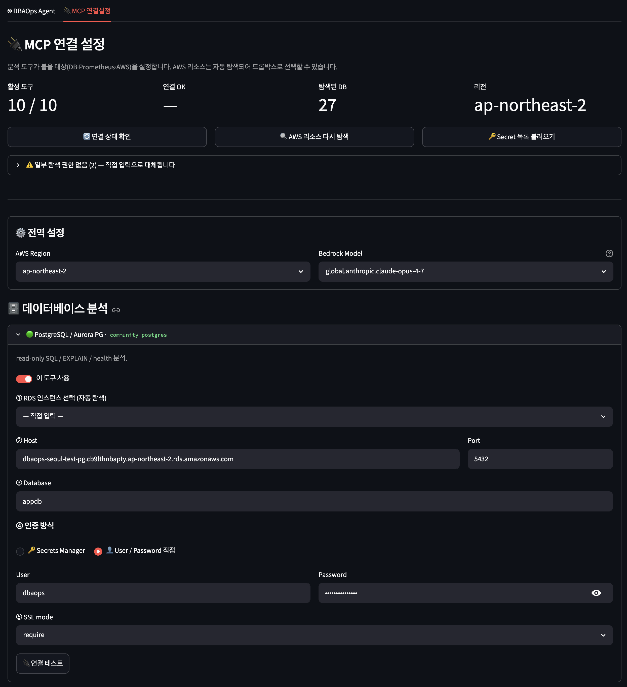

# DBAOps-Agent — 온보딩 가이드

프로젝트 소개부터 배포·설정·사용법까지 한 문서로 정리.

---

## 1. DBAOps-Agent 란

DB/인프라 장애 대응·성능 분석을 도와주는 **AI SRE 동료**. 자연어로 물어보면 실시간으로 메트릭·로그·DB 상태를 확인하고 답한다.

**핵심 특징:**
- 자연어 대화 — "Aurora CPU 왜 높아?", "slow query 있어?" 처럼 물으면 알아서 도구를 골라 확인
- 10종 MCP 도구 — PostgreSQL, MySQL, Prometheus, CloudWatch, Performance Insights, MSK, S3 로그, AWS API
- 대화 연속성 — 같은 스레드/세션에서 맥락을 기억하며 이어 대화
- 차트 자동 생성 — 시계열·순위 데이터는 PNG 차트로 시각화

**인터페이스:**
- **Streamlit 웹 UI** (`http://<ec2-ip>:8501`) — 브라우저에서 채팅 + MCP 연결 설정
- **Slack 봇** (`@DBAOps`) — 채널에서 멘션, 스레드로 이어 대화

---

## 2. 아키텍처

```
EC2 (instance role: DatabaseAdministrator + bedrock:InvokeModel)
└─ docker compose
   ├─ mcp-router  :9000   MCP 도구 라우터 (DB/AWS/Prometheus 연결)
   ├─ agent       :8080   LangGraph 단일 에이전트 (Bedrock Claude)
   ├─ streamlit   :8501   웹 UI + 연결 설정 페이지
   ├─ slack-bot           Slack Socket Mode (outbound only)
   └─ (선택 --profile prometheus)
      ├─ prometheus        :9090   메트릭 수집/저장
      ├─ postgres-exporter          RDS PG 내부 지표
      ├─ mysqld-exporter            RDS MySQL 내부 지표
      └─ node-exporter              EC2 호스트 메트릭
```

- 기본 4개 컨테이너가 하나의 docker network 안에서 통신.
  `--profile prometheus` 로 기동하면 4개 추가(prometheus `:9090`, postgres-exporter,
  mysqld-exporter, node-exporter — EC2 호스트 메트릭) → §4-4 참고
- 외부 노출 포트: 기본 Streamlit `8501` 하나 (Slack 은 outbound WebSocket).
  prometheus 프로파일 시 `9090` 도 노출되므로 SG 로 제한 권장
- 자격증명: EC2 instance role 자동 사용 (별도 키 불필요)

---

## 3. 사전 조건

인프라팀이 준비해야 할 것:

| 항목 | 내용 |
|---|---|
| EC2 인스턴스 | 분석 대상 DB·Prometheus 와 같은 VPC. t3.large 이상, 디스크 30GB+ |
| Instance profile | `DatabaseAdministrator` (관리형) + `bedrock:InvokeModel` 인라인 |
| Egress | Bedrock 호출용 (NAT 또는 VPC endpoint) + 이미지 pull 용 인터넷 |
| 인바운드 8501 | Streamlit 접속 (사내망/VPN/보안그룹 제한 권장) |
| DB 접근 SG | EC2 → PG/MySQL(5432/3306), Prometheus(9090) 인바운드 허용 |

Bedrock 인라인 정책:
```json
{
  "Version": "2012-10-17",
  "Statement": [{
    "Effect": "Allow",
    "Action": ["bedrock:InvokeModel", "bedrock:InvokeModelWithResponseStream"],
    "Resource": "*"
  }]
}
```

---

## 4. 배포 (15분)

배포 방식은 **두 가지** — 환경에 맞는 쪽을 골라 진행한다. 기능은 완전히 동일하다
(같은 코드, 같은 연결설정 UI, 같은 Slack 봇).

| | 방법 A — docker compose (권장) | 방법 B — 생 EC2 (docker 없이) |
|---|---|---|
| 가이드 | **아래 §4-1 ~ §4-4 계속 진행** | **[`deploy/ec2-vanilla/README.md`](../deploy/ec2-vanilla/README.md)** 로 이동 |
| 적합한 경우 | docker 사용 가능한 일반적인 환경 | 사내 정책상 docker 불가, 호스트 직접 구동 선호 |
| 사전 요구 | docker + compose | 없음 (install.sh 가 OS 패키지 설치) |
| 프로세스 관리 | compose restart 정책 | systemd (자동 재시작·부팅 기동) |
| 격리 | 이미지가 python/node 버전 고정 | 호스트 OS 의존 (AL2023 / Ubuntu 22.04+) |

> 방법 B 를 선택했다면 이 문서의 §4 나머지(docker 기준)는 건너뛰고,
> vanilla 가이드의 설치를 마친 뒤 **§5 연결 설정**부터 다시 이 문서로 돌아오면 된다.

### 4-1. EC2 부트스트랩 (방법 A — docker)

Amazon Linux 2023 기준:
```bash
sudo dnf -y install docker git
sudo systemctl enable --now docker
sudo usermod -aG docker ec2-user
# 재로그인 후
sudo mkdir -p /usr/local/lib/docker/cli-plugins
sudo curl -sL "https://github.com/docker/compose/releases/latest/download/docker-compose-linux-$(uname -m)" \
  -o /usr/local/lib/docker/cli-plugins/docker-compose
sudo chmod +x /usr/local/lib/docker/cli-plugins/docker-compose
docker compose version
```

### 4-2. 코드 + 설정

```bash
git clone https://github.com/blait/DBAOps-Agent.git dbaops
cd dbaops/deploy/ec2-allinone
cp .env.example .env
nano .env
```

`.env` 필수/선택:

| 키 | 설명 | 필수 |
|---|---|---|
| `AWS_REGION` | EC2/Bedrock 리전 (예: `ap-northeast-2`) | ✅ 필수 |
| `BEDROCK_MODEL_ID` | 에이전트가 쓸 모델. 기본값 있어 생략 가능 | 기본값 사용 |
| `SLACK_BOT_TOKEN` | Slack 봇 토큰 (`xoxb-...`) | Slack 쓸 때만 |
| `SLACK_APP_TOKEN` | Slack Socket Mode 토큰 (`xapp-...`) | Slack 쓸 때만 |
| `STREAMLIT_URL` | Slack 답변의 "차트 전체 보기" 링크용 (예: `http://<ec2-ip>:8501`) | 선택 |
| `PROMETHEUS_PORT` | Prometheus 외부 노출 포트 (기본 `9090`) | prometheus 프로파일 시 |
| `PG_EXPORTER_DSN` | postgres-exporter 가 붙을 PG DSN (`postgresql://user:pw@host:5432/db?sslmode=require`) | prometheus 프로파일 시 필수 |

**작성 예시 (`.env`)** — 최소 구성은 `AWS_REGION` 한 줄이면 된다. Slack 봇까지 쓰면 토큰 2줄 추가:

```bash
# ── 최소 구성 (Streamlit 웹 UI 만 쓸 때) ───────────────
AWS_REGION=ap-northeast-2

# ── Slack 봇도 쓸 때 (위에 더해 아래 2줄 추가) ─────────
SLACK_BOT_TOKEN=<xoxb-로 시작하는 봇 토큰>      # Slack 앱에서 발급 (§6)
SLACK_APP_TOKEN=<xapp-로 시작하는 앱 토큰>      # Slack 앱에서 발급 (§6)

# ── 선택 (없어도 동작) ─────────────────────────────────
# BEDROCK_MODEL_ID=global.anthropic.claude-opus-4-7   # 다른 모델 쓸 때만
# STREAMLIT_URL=http://3.39.0.43:8501                 # Slack 차트 링크에 EC2 공인 IP
```

> `<ec2-ip>` 는 이 EC2 의 **공인 IP**(또는 사내 접근 도메인). `STREAMLIT_URL` 을 비워두면
> Slack 답변에 차트 링크만 빠질 뿐, 분석/차트 첨부 자체는 정상 동작한다.
> 토큰 발급 절차는 **§6 Slack 봇 연결**에 단계별로 있다.

### 4-3. 기동

```bash
docker compose up -d --build
```

처음 빌드 수 분 소요. 이후 캐시 사용으로 빠름.

확인:
```bash
docker compose ps          # 4개(프로파일 시 8개) Up/running 확인
docker compose logs agent  # "serving on 0.0.0.0:8080" 확인
```

Slack 없이 먼저:
```bash
docker compose up -d --build mcp-router agent streamlit
```

### 4-4. (선택) Prometheus 모니터링 스택

RDS 내부 지표(`pg_*`/`mysql_*`)와 EC2 호스트 지표(`node_*`)를 **PromQL 로 조회**할 수 있게
동봉된 Prometheus + exporter 3종을 같은 compose 안에서 띄운다.
**고객이 자체 Prometheus 를 이미 운영 중이면 이 절은 생략**하고, 그 URL 만 연결설정(§5-4)에 입력하면 된다.

절차:

1. `.env` 에 `PG_EXPORTER_DSN` 작성:
   ```bash
   PG_EXPORTER_DSN=postgresql://user:pw@host:5432/db?sslmode=require
   ```
2. MySQL 은 파일 방식으로 설정:
   ```bash
   cp prometheus/my.cnf.example prometheus/my.cnf
   nano prometheus/my.cnf   # host / user / password 기입
   ```
   비밀번호의 특수문자가 `.env` 변수 치환과 충돌할 수 있어 **파일 방식**을 쓴다.
   `SELECT` / `PROCESS` / `REPLICATION CLIENT` 권한만 가진 **전용 모니터링 유저** 권장.
3. node-exporter 는 설정 불필요 (EC2 호스트 메트릭 자동 수집).
4. 기동:
   ```bash
   docker compose --profile prometheus up -d
   ```
5. Streamlit **🔌 MCP 연결설정**의 Prometheus URL 에 `http://prometheus:9090` 입력
   — 같은 compose 네트워크라 **서비스명으로 접근**한다.
6. 인프라 식별자(§5-5)의 `prom_instance_id` 는 `prometheus.yml` 의 `instance` 라벨
   (예: `dbaops-seoul-allinone`)과 일치시킨다.

scrape job 4종 (`prometheus/prometheus.yml`):

| job | 대상 | 지표 |
|---|---|---|
| `prometheus` | 자기 자신 | Prometheus 상태 |
| `rds-postgres` | postgres-exporter `:9187` | `pg_*` (RDS PG 내부) |
| `rds-mysql` | mysqld-exporter `:9104` | `mysql_*` (RDS MySQL 내부) |
| `ec2-host` | node-exporter `:9100` | `node_*` (EC2 호스트 OS) |

기동 확인:
```bash
docker compose ps   # 8개 Up 확인
```
이후 채팅에서 `Prometheus로 PG 살아있는지 확인해줘` 같은 질문으로 검증.

---

## 5. 연결 설정 (Streamlit UI — 코드 수정 없이 화면에서)

연결 정보는 파일을 직접 고칠 필요 없이 **브라우저 화면에서 전부 설정**한다. 입력하면
`/data/connections.json`(docker volume)에 저장되고, **mcp-router 가 즉시 반영**(재시작 불필요).

### 5-1. 화면 진입

1. 브라우저로 `http://<ec2-ip>:8501` 접속
2. 좌측/상단 탭에서 **🔌 MCP 연결설정** 선택
3. 진입 즉시 EC2 **instance role 로 AWS 리소스를 자동 탐색**한다(RDS·EC2·S3·MSK·Secret).
   → 대부분의 입력이 **드롭박스 선택**으로 바뀐다. 권한이 없는 항목만 조용히 직접입력으로 대체.

### 5-2. 화면 구성

```
┌ 상태 대시보드 ─ [활성 도구 n/10] [연결 OK k] [탐색된 DB] [리전] ─────────┐
├ 액션바 ─ [🔄 연결 상태 확인] [🔍 AWS 리소스 다시 탐색] [🔑 Secret 목록] ─┤
├ ⚙️ 전역 설정 ─ AWS Region / Bedrock Model ──────────────────────────────┤
├ 🗄️ 데이터베이스 분석 ─ PostgreSQL · MySQL · RDS PI                       │
├ 📊 인프라 메트릭     ─ Prometheus · CloudWatch · MSK                      │
├ 📜 로그 분석         ─ S3 로그                                            │
├ ☁️ AWS 범용 도구     ─ aws-api · aws-api(CLI) · AWS Doc                   │
├ 🏷️ 인프라 식별자     ─ Aurora/writer/reader/MSK/버킷 ID (선택)            │
└ [💾 전체 저장 후 적용]  [🔌 전체 연결 테스트] ──────────────────────────┘
```

각 도구는 카드(expander)로 펼쳐지고, 상단에 `🟢 9 tools` 같은 **실시간 연결 배지**가 붙는다.



> 실제 화면. 상단에 활성 도구·탐색된 DB·리전 대시보드, 그 아래 전역 설정(Region/Model),
> **데이터베이스 분석** 카드를 펼치면 ①RDS 선택 → ②Host/Port → ③Database → ④인증 방식
> → ⑤SSL mode 순서로 입력하고 맨 아래 **연결 테스트**로 실접속을 확인한다.

### 5-3. DB 연결 입력 흐름 (PostgreSQL / MySQL)

카드를 펼치면 순서대로:

1. **① RDS 인스턴스 선택** — 자동 탐색된 목록에서 고르면 Host/Port 가 **자동 채워짐**
   (`✅ dbaops-seoul-test-pg → host:5432`). 목록에 없으면 "직접 입력".
2. **② Host / Port** — 자동 채워지거나 직접 입력
3. **③ Database** — DB 이름 (예: `appdb`, `dbaops`)
4. **④ 인증 방식** — 라디오로 택1:
   - 🔑 **Secrets Manager** — "🔑 Secret 목록 불러오기" 누른 뒤 드롭박스에서 ARN 선택
   - 👤 **User / Password 직접** — 사용자명·비밀번호 입력
5. **⑤ SSL mode** (PG) — `require`(기본)/`prefer`/`disable`/`verify-ca`/`verify-full`
6. **⑥ Access mode** (PG) — `restricted`(기본, 조회만) / `unrestricted`(EXPLAIN·인덱스 분석 도구 활성 —
   **반드시 읽기전용 DB 계정과 함께** 사용). `connections.json` 키는 `PG_ACCESS_MODE`.

> 카드 안의 **🔌 연결 테스트** 버튼 → 해당 도구만 즉시 검증 → `✅ 연결 성공 — 9 tools`.

### 5-4. 그 외 도구

| 도구 | 입력 | 비고 |
|---|---|---|
| **Prometheus** | URL (`http://host:9090`) | EC2 자동 탐색 → 선택 시 `:9090` 자동, 또는 직접 입력 |
| **MSK metrics** | Cluster Name (+ 기본 Topic/CG 선택) | 자동 탐색 드롭박스. 비밀번호 없음 |
| **RDS PI / CloudWatch / S3 / aws-api / aws-doc** | 없음 | EC2 **instance role** 권한만으로 동작 (카드에 "추가 정보 불필요" 표시) |

### 5-5. 인프라 식별자 (선택)

분석 프롬프트가 참조할 식별자(Aurora 클러스터/writer/reader, MSK 클러스터명, 로그 버킷 등)를
드롭박스로 지정. **비워두면 에이전트가 describe 로 직접 찾으므로 필수 아님.**

### 5-6. 저장

- **💾 전체 저장 후 적용** — 모든 카드 설정을 `connections.json` 에 기록 + 라우터 반영 + 상태 갱신
- **🔌 전체 연결 테스트** — 저장 후 모든 도구 healthz 한 번에 확인

> 저장 후 즉시 적용된다(컨테이너 재시작 불필요). 연결정보는 docker volume `dbaops-data` 에
> 영구 저장 → 세션을 꺼도 유지된다. 백업/복원은 §8 참고.

---

## 6. Slack 봇 연결 (5분)

### 6-1. Slack 앱 생성

https://api.slack.com/apps → **Create New App** → **From a manifest** → 아래 YAML:

```yaml
display_information:
  name: DBAOps Agent
  description: DB/인프라 분석 에이전트
features:
  bot_user:
    display_name: DBAOps
    always_online: true
oauth_config:
  scopes:
    bot:
      - app_mentions:read
      - chat:write
      - files:write
      - channels:history
      - groups:history
settings:
  event_subscriptions:
    bot_events:
      - app_mention
      - message.channels
      - message.groups
  interactivity:
    is_enabled: true
  socket_mode_enabled: true
```

### 6-2. 토큰 발급

1. **Basic Information** → App-Level Tokens → Generate (`connections:write` scope) → `xapp-...` 복사
2. **OAuth & Permissions** → Install to Workspace → Bot Token `xoxb-...` 복사

### 6-3. 기동

```bash
# .env 에 토큰 추가
nano .env
#   SLACK_BOT_TOKEN=xoxb-...
#   SLACK_APP_TOKEN=xapp-...

docker compose up -d --build slack-bot
docker compose logs -f slack-bot   # "Bolt app is running!" 확인
```

### 6-4. 사용

```
/invite @DBAOps              ← 채널에 초대
@DBAOps Aurora CPU 어때?     ← 멘션으로 질문
(같은 스레드에서) slow query는?  ← 멘션 없이 이어 대화
```

> 봇이 매 요청마다 **스레드 대화 이력(최대 4,000자)을 자동 주입**하므로,
> agent 가 재시작돼도 스레드 맥락이 이어진다.

상세: [`deploy/ec2-allinone/SLACK_SETUP.md`](../deploy/ec2-allinone/SLACK_SETUP.md)

---

## 7. 사용법 + 예시 프롬프트

> 도구별 "이거 물으면 뭘 보나" 카탈로그는 **[§11 연결된 MCP 도구 전체](#11-연결된-mcp-도구-전체--무엇을-보고-뭐라고-물어보나)** 참고. 여기선 사용 흐름 위주.

### 기본 대화

| 질문 | 에이전트 동작 |
|---|---|
| "Aurora CPU 지금 어때?" | CloudWatch/PI 메트릭 확인 → 수치 + 차트 |
| "최근 slow query 보여줘" | DB에서 slow_log 또는 pg_stat_statements 조회 |
| "왜 느린 거야?" | 여러 도구 복합 조사 → 가설 + 근거 제시 |
| "orders 테이블 건수" | SQL 실행 → 결과 |
| "Prometheus up 메트릭 확인" | PromQL 조회 |

### 장애 대응 시나리오

```
@DBAOps 지금 Aurora 응답이 느린데 원인 파악해줘
```
→ 에이전트가 순서대로:
1. PI에서 top wait events 확인
2. slow query 있는지 체크
3. CPU/메모리/커넥션 메트릭 확인
4. 종합 판단 + 권고

### 이어 묻기

```
@DBAOps RDS 인스턴스 목록 보여줘
  ↳ writer 의 PI top SQL 보여줘
  ↳ 그 쿼리 EXPLAIN 해줘
  ↳ 인덱스 추천해줘
```

### 가벼운 질문 (도구 안 씀)

```
@DBAOps pg_stat_statements 가 뭐야?
@DBAOps Aurora failover 순서 알려줘
```

---

## 8. 운영

### 자주 쓰는 명령

```bash
cd ~/dbaops/deploy/ec2-allinone

# 코드 갱신 + 재빌드
git pull && docker compose up -d --build

# 특정 서비스만 재빌드
docker compose up -d --build slack-bot

# 실시간 로그
docker compose logs -f agent

# 전체 종료 (연결설정 유지)
docker compose down

# 전체 초기화 (연결설정 삭제)
docker compose down -v
```

### 연결설정 백업/복원

연결설정은 docker volume `dbaops-data` 안의 `/data/connections.json`에 저장.

```bash
# 백업
docker cp ec2-allinone-streamlit-1:/data/connections.json ./connections_backup.json

# 복원
docker cp ./connections_backup.json ec2-allinone-streamlit-1:/data/connections.json
docker compose restart mcp-router
```

---

## 9. 트러블슈팅

| 증상 | 확인 |
|---|---|
| 채팅이 "호출할 수 없습니다" | agent 컨테이너 상태, `AGENT_HTTP_URL` env |
| 도구 연결 ❌ | 연결설정 값, EC2→DB 보안그룹, `docker compose logs mcp-router` |
| LLM 오류(AccessDenied) | instance role 에 `bedrock:InvokeModel` 있는지, 리전/모델ID |
| Slack 무반응 | 봇 토큰, `app_mention` 구독, 채널 초대, `docker compose logs slack-bot` |
| 스레드 후속질문 무반응 | `message.channels` 이벤트 구독 + 재설치했나 |
| 연결 테스트 오래 걸림 | 호스트 도달 불가(DNS/SG) — 30~50초 타임아웃 후 에러 표시 |

---

## 10. 관련 문서

| 문서 | 내용 |
|---|---|
| [`deploy/ec2-allinone/README.md`](../deploy/ec2-allinone/README.md) | EC2 배포 상세 (docker compose 초심자용) |
| [`deploy/ec2-allinone/SLACK_SETUP.md`](../deploy/ec2-allinone/SLACK_SETUP.md) | Slack 앱 생성 상세 |
| [`docs/CONNECTION_INFO.md`](CONNECTION_INFO.md) | 연결 정보가 어디서 오는지 (자동탐색 vs 수동) |
| [`docs/SERVICE_GUIDE.md`](SERVICE_GUIDE.md) | 시스템 내부 상세 (코드 레벨) |
| [`docs/iam/IAM_APPLY_GUIDE.md`](iam/IAM_APPLY_GUIDE.md) | IAM 권한 부여 절차 |

---

## 11. 연결된 MCP 도구 전체 — 무엇을 보고, 뭐라고 물어보나

DBAOps-Agent 가 사용하는 MCP 도구와 연결 대상이다. 자연어로 물으면 에이전트가
**아래 도구를 알아서 골라** 호출한다(도구 이름을 외울 필요 없음). "추천 질문"은
Slack(`@DBAOps ...`)·Streamlit 채팅 어디서든 그대로 쓸 수 있다.

### 데이터베이스 (DB 내부 직접 조회)

| 도구 | 연결 대상 | 무엇을 보나 | 추천 질문 |
|---|---|---|---|
| `community-postgres` | RDS/Aurora **PostgreSQL** (host/port/db/user) | 9개 도구: `execute_sql`, `explain_query`, `analyze_query_indexes`, `analyze_workload_indexes`, `analyze_db_health`, `get_top_queries`, `list_schemas`/`objects`, `get_object_details` — EXPLAIN/인덱스 분석은 **unrestricted 모드**(§5-3)일 때 활성 | `orders 테이블 status별 건수 보여줘` · `pg_stat_statements 로 제일 무거운 쿼리 top 5` · `이 쿼리 실행계획 봐줘` · `이 쿼리 EXPLAIN 하고 인덱스 추천해줘` |
| `community-mysql` | RDS **MySQL** (host/port/db/user) | 테이블·실제 데이터, `SHOW STATUS`, 스키마 | `dbaops_users 에서 region별 사용자 수` · `dbaops_orders 최근 5건` · `현재 연결 수랑 느린 쿼리 설정 알려줘` |

### 메트릭 — Prometheus (DB 내부 지표를 PromQL 로)

| 도구 | 연결 대상 | 무엇을 보나 | 추천 질문 |
|---|---|---|---|
| `community-prometheus` | self-hosted **Prometheus** (`http://host:9090`)<br>※ 동봉 compose 프로파일로 즉시 구축 가능(§4-4), URL 은 `http://prometheus:9090`. `postgres-exporter`/`mysqld-exporter` 로 RDS 내부 지표, `node-exporter` 로 EC2 호스트 지표 수집. 또는 **고객 기존 Prometheus** | `pg_up`/`mysql_up`, `pg_stat_activity_count`(active/idle), `pg_database_size_bytes`, `mysql_global_status_*`, `node_*`(EC2 호스트 CPU/메모리/디스크) | `Prometheus로 PG랑 MySQL 살아있는지 확인해줘` · `PG 커넥션 상태 active/idle 표로` · `idle in transaction 세션 있어?` · `MySQL 초당 쿼리 추이 그려줘` |

> RDS 는 관리형이라 직접 스크랩 불가 → exporter 가 DB 에 붙어 지표를 뽑고 Prometheus 가 pull.
> 고객이 이미 Prometheus 를 운영하면 URL 만 그쪽으로 바꿔 기존 자산(alert rule 등)에 그대로 붙는다.

### 메트릭/진단 — AWS 관리형 (instance role 만으로 동작)

| 도구 | 연결 대상 | 무엇을 보나 | 추천 질문 |
|---|---|---|---|
| `awslabs-cloudwatch` | **CloudWatch** (AWS/RDS·Aurora·EC2·MSK…) | CPU/메모리/커넥션/IOPS 등 벤디드 메트릭, 알람, Logs Insights | `Aurora CPU 최근 1시간 어때?` · `DB 커넥션 수 추이 보여줘` · `지금 ALARM 상태인 알람 있어?` |
| `rds-pi` | **Performance Insights** (Aurora/RDS writer) | top SQL by AAS, wait events, 부하 차원 분석 | `Performance Insights 로 제일 무거운 SQL 뭐야?` · `지금 무슨 wait event 가 부하 잡고 있어?` |
| `msk-metrics` | **MSK** (CloudWatch 경유) | BytesIn/Out, MessagesIn, consumer lag(MaxOffsetLag) | `MSK 최근 처리량 BytesIn 보여줘` · `consumer lag 쌓이고 있어?` |

### 로그 · 메타데이터 (instance role)

| 도구 | 연결 대상 | 무엇을 보나 | 추천 질문 |
|---|---|---|---|
| `aws-api` | RDS/EC2/MSK **describe** API | 인스턴스 목록·상태·엔드포인트, DB 로그 파일 목록/내용, PI 차원 + RDS 이벤트 이력(`describe_rds_events` — failover/재시작/파라미터 변경, 최대 14일) + AWS 권고사항(`describe_db_recommendations`) + PI 분석 리포트(`pi_create/get_analysis_report` — 소형 인스턴스 클래스 미지원) | `RDS 인스턴스 목록이랑 상태 보여줘` · `이 인스턴스 최근 에러 로그 가져와줘` · `최근 3일 RDS에 failover나 설정 변경 있었어?` · `AWS가 우리 DB에 권고하는 개선사항 확인해줘` |
| `awslabs-aws-api` | **임의 read-only AWS CLI** 실행 (`call_aws` / `suggest_aws_commands`) | describe 도구에 없는 모든 read-only AWS API | `우리 리전 RDS 스냅샷 목록 뽑아줘` |
| `s3-log-fetch` | **S3** 로그 버킷 | gzip 로그 byte-range + regex 검색 | `S3 로그에서 최근 ERROR 패턴 찾아줘` |
| `awslabs-aws-doc` | **AWS 공식 문서** | 문서 검색·요약 (도메인 지식) | `Aurora failover 순서 알려줘` · `pg_stat_statements 설정 방법은?` |

> **모드별 차이**: PI/CloudWatch/MSK/aws-api/s3/doc 은 EC2 **instance role** 만으로 동작(연결 입력 불필요).
> PG/MySQL/Prometheus 만 연결 정보(host·인증)를 **🔌 MCP 연결설정** 탭에서 입력한다.

### 한 번에 보여주는 복합 질문 (여러 도구 동시 호출)

```
@DBAOps 지금 Aurora 응답이 느린데 원인 파악해줘
   → PI top SQL + CloudWatch CPU/커넥션 + slow query 를 종합해 가설 제시

@DBAOps DB 전반 건강검진 한 번 해줘
   → Prometheus 커넥션 상태 + CloudWatch 메트릭 + PI 부하 + 테이블 상태 종합
```

---

## 12. Next Step — A2A 에이전트 협업

DBAOps-Agent 는 **운영 시점의 지상 실측**(실제 row 수·테이블 크기·쿼리 패턴·PI·현재 부하·복제 지연)을 안다. 고객사가 이미 보유한 **스키마 검수 에이전트**는 **설계 시점의 지식**(DDL·명명규칙·정규화·인덱스 설계·마이그레이션 안전성)을 안다.

두 에이전트는 아는 영역이 깨끗하게 분리돼 서로를 흉내 낼 수 없다 → **A2A(Agent-to-Agent) 협업의 이상적 조합**. 한쪽이 다른 쪽을 흡수하지 않고, 각 팀의 소유권·책임 경계를 존중하면서 능력을 합친다.

> **권장 진행**: 아래 6개를 한 번에 붙이지 말 것. **①을 먼저 PoC 로 증명**하고, 검증되면 나머지를 단계적으로 추가한다. 한 번에 다 하면 A2A 통합 장애가 어디서 났는지 못 찾는다.

### A2A 협업 시나리오 6선

| # | 시나리오 | 호출 방향 | 효과 |
|---|---|---|---|
| **①** | **프로덕션 현실 기반 스키마 변경 리뷰** (플래그십) | 스키마 → DBAOps | 스키마 agent 가 마이그레이션 리뷰 중 DBAOps 에 "이 테이블 실제 크기·write 부하·복제 지연은?" 질의 → 일반론("인덱스 추가 권장")이 실행 가능한 안전 판단("초당 5k write 도는 2억 row 테이블 락, off-peak 에 online DDL")으로 바뀜 |
| **②** | **인덱스 추천 검증** | 스키마 → DBAOps | 스키마 agent 가 인덱스 추천 → DBAOps 가 중복 여부·실제 사용량(PI/pg_stat) 확인 → "추천 인덱스는 idx_xxx 와 중복, 그건 0회 스캔" 같은 반박까지 |
| **③** | **RCA → 스키마 교정안 위임** (방향 역전) | DBAOps → 스키마 | DBAOps 가 장애 RCA 중 근본 원인이 나쁜 스키마(누락 인덱스·잘못된 타입·파티셔닝 부재)임을 발견 → 스키마 agent 에 "수정안 DDL 만들어줘" 위임 → 검수된 DDL 회신. 진단부터 교정안까지 한 흐름 |
| **④** | **스키마 변경 배포 후 검증** | 스키마 → DBAOps | 스키마 변경 배포 후 DBAOps 가 해당 테이블/쿼리 모니터링 → "추가 인덱스가 지금 쿼리 서빙 중, seq scan→index scan, AAS 8→1.2" 보고. 리뷰 예측이 실제로 맞았는지 확인 |
| **⑤** | **명명규칙·정합성 드리프트 감지** | DBAOps → 스키마 | DBAOps 가 운영 중 새로 생긴 테이블/컬럼 발견 → 스키마 agent 에 "이거 명명규칙·정규화 기준 맞아?" 질의 → 설계 표준 위반을 운영 단계에서 조기 포착 |
| **⑥** | **용량 예측 기반 사전 설계 권고** | DBAOps → 스키마 | DBAOps 가 테이블 증가 추세·파티션 포화 예측 → 스키마 agent 에 "이 추세면 6개월 뒤 파티셔닝/아카이빙 필요, 설계안?" 질의 → 운영 데이터가 사전 설계 의사결정을 트리거 |

### 기술 메모

- **프로토콜**: A2A (Agent Card 로 능력 노출 + JSON-RPC 호출). DBAOps 는 운영 조회 능력(테이블 통계·PI·메트릭·복제 상태)을 Agent Card 에 노출하고, 스키마 agent 의 카드(리뷰·DDL 생성)를 소비.
- **호출자(orchestrator) 설계**: ①②④ 는 스키마 agent 가 DBAOps 를 호출(설계가 운영을 조회), ③⑤⑥ 은 DBAOps 가 스키마 agent 를 호출(운영이 설계를 위임). 양방향 카드 등록 필요.
- **왜 흡수가 아니라 A2A 인가**: DBAOps 가 스키마 검수를 재구현할 수도 있으나, 고객이 그 agent 를 **소유**하고 그들의 도메인·책임이다. A2A 로 팀 경계를 존중하는 것 자체가 파일럿 정착("이건 우리 도구")의 채택 논리가 된다.
- **리스크**: A2A 는 통합 복잡도·장애 표면을 늘린다. ① 단일 시나리오로 가치를 먼저 증명한 뒤 확장.
